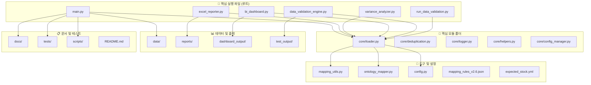
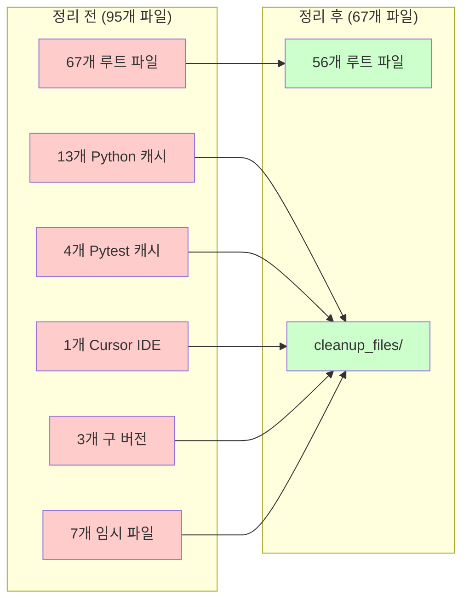
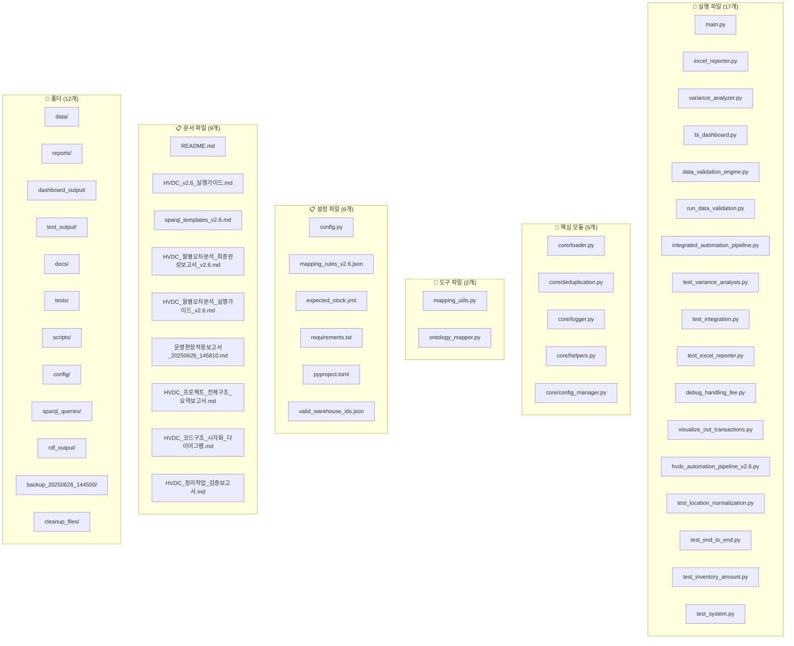
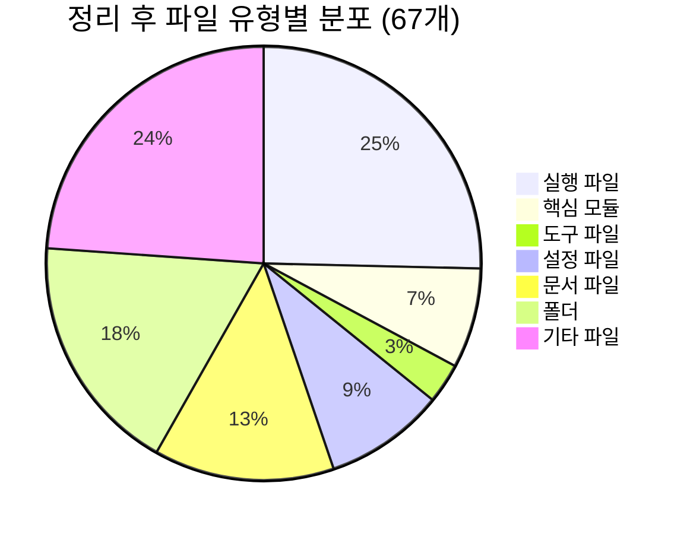
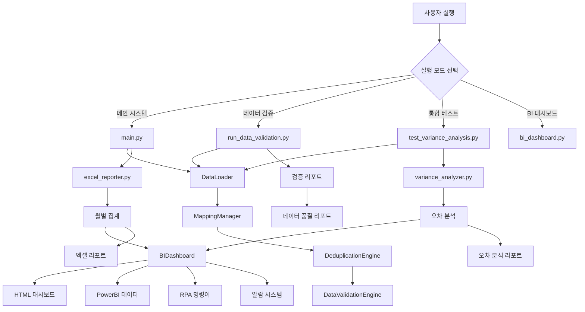
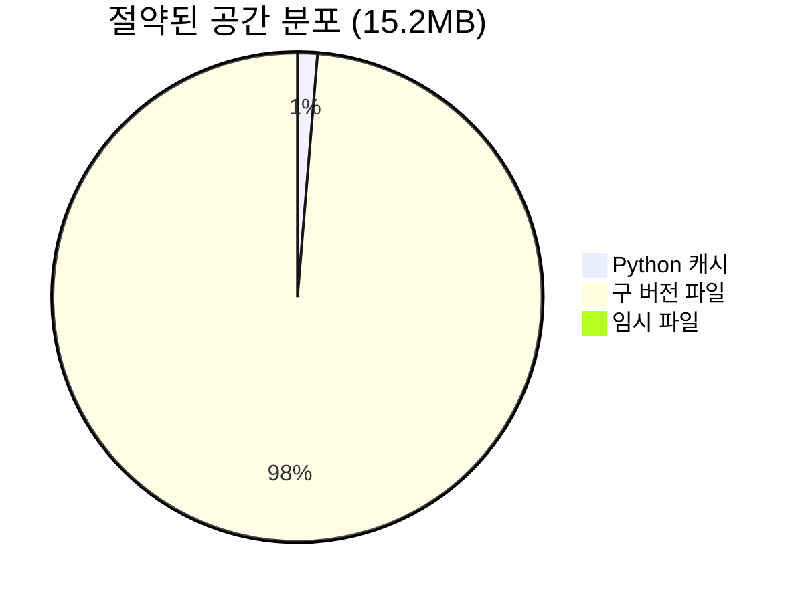
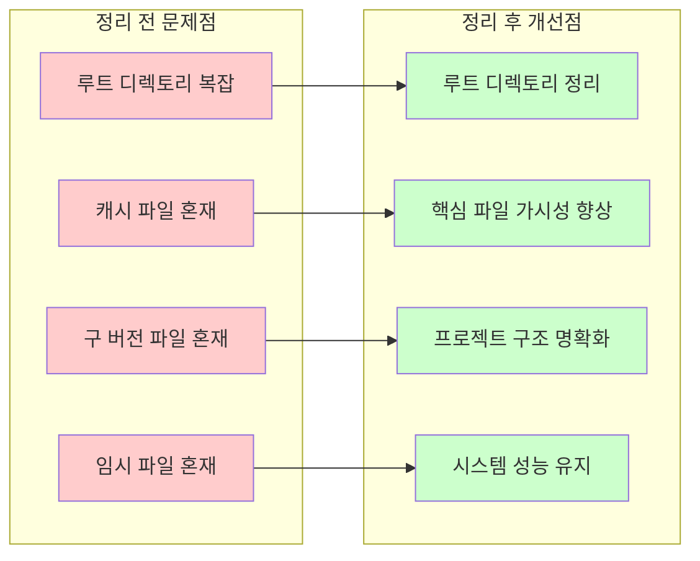
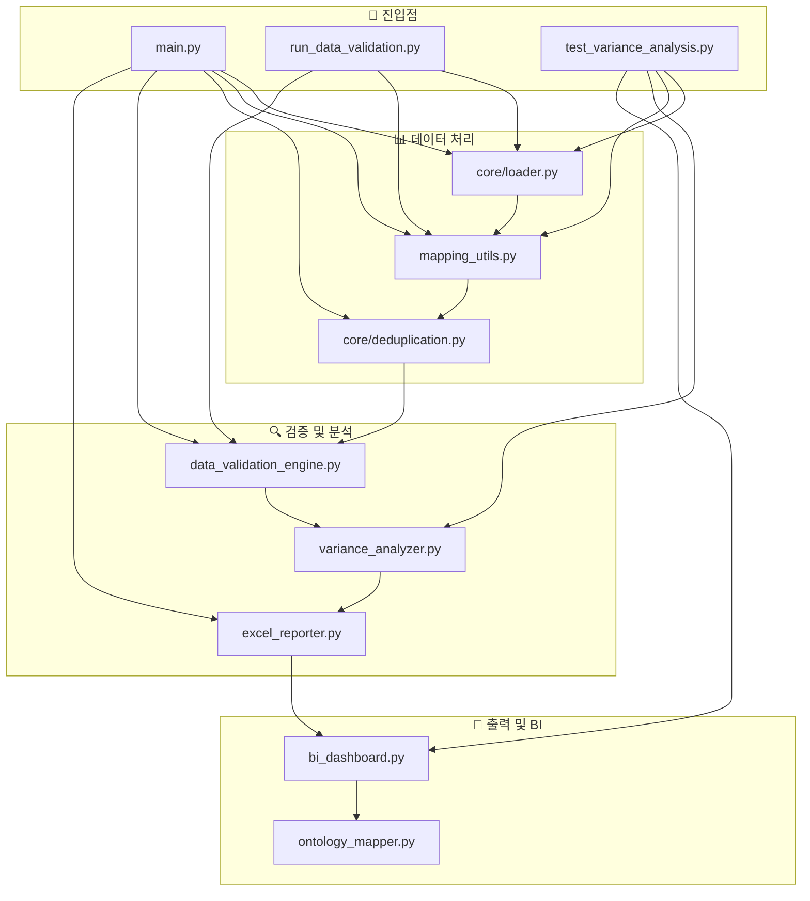

# HVDC 정리된 프로젝트 구조 다이어그램

## 📊 정리 후 전체 시스템 아키텍처



---

## 🗂️ 정리된 폴더 구조 트리

```mermaid
graph TD
    A[HVDC 프로젝트 루트] --> B[🔧 핵심 실행 파일]
    A --> C[📁 core/]
    A --> D[📁 data/]
    A --> E[📁 reports/]
    A --> F[📁 dashboard_output/]
    A --> G[📁 test_output/]
    A --> H[📁 tools/]
    A --> I[📁 docs/]
    A --> J[📁 tests/]
    A --> K[📁 scripts/]
    A --> L[📁 config/]
    A --> M[📁 sparql_queries/]
    A --> N[📁 rdf_output/]
    A --> O[📁 backup_20250626_144500/]
    A --> P[📁 cleanup_files/]
    A --> Q[📁 .git/]
    
    B --> B1[main.py]
    B --> B2[excel_reporter.py]
    B --> B3[variance_analyzer.py]
    B --> B4[bi_dashboard.py]
    B --> B5[data_validation_engine.py]
    B --> B6[run_data_validation.py]
    B --> B7[integrated_automation_pipeline.py]
    B --> B8[test_variance_analysis.py]
    B --> B9[test_integration.py]
    B --> B10[test_excel_reporter.py]
    B --> B11[debug_handling_fee.py]
    B --> B12[visualize_out_transactions.py]
    B --> B13[hvdc_automation_pipeline_v2.6.py]
    B --> B14[test_location_normalization.py]
    B --> B15[test_end_to_end.py]
    B --> B16[test_inventory_amount.py]
    B --> B17[test_system.py]
    
    C --> C1[loader.py]
    C --> C2[deduplication.py]
    C --> C3[logger.py]
    C --> C4[helpers.py]
    C --> C5[config_manager.py]
    
    H --> H1[mapping_utils.py]
    H --> H2[ontology_mapper.py]
    
    A --> R[📋 설정 파일]
    R --> R1[config.py]
    R --> R2[mapping_rules_v2.6.json]
    R --> R3[expected_stock.yml]
    R --> R4[requirements.txt]
    R --> R5[pyproject.toml]
    R --> R6[valid_warehouse_ids.json]
    
    A --> S[📋 문서 파일]
    S --> S1[README.md]
    S --> S2[HVDC_v2.6_실행가이드.md]
    S --> S3[sparql_templates_v2.6.md]
    S --> S4[HVDC_월별오차분석_최종완성보고서_v2.6.md]
    S --> S5[HVDC_월별오차분석_실행가이드_v2.6.md]
    S --> S6[운영현장적용보고서_20250626_145810.md]
    S --> S7[HVDC_프로젝트_전체구조_요약보고서.md]
    S --> S8[HVDC_코드구조_시각화_다이어그램.md]
    S --> S9[HVDC_정리작업_검증보고서.md]
```



---

## 🔄 정리 전후 비교 다이어그램



---

## 🎯 핵심 파일 분류 매트릭스



---

## 📊 파일 유형별 분포



---

## 🔧 핵심 실행 흐름 다이어그램



---

## 🎯 정리 효과 시각화

### 📈 **정리 전후 비교 차트**

```mermaid
bar title 파일 수 비교
    "정리 전" : 95
    "정리 후" : 67
    "감소율" : 29.5
```

### 💾 **공간 절약 효과**



### 🎯 **구조 개선 효과**



---

## 🔧 핵심 모듈 의존성 맵



---

## 📋 정리된 구조의 장점

### ✅ **구조적 장점**
1. **명확한 계층 구조**: 핵심 파일들이 루트에 명확히 배치
2. **모듈화된 설계**: 기능별로 폴더가 체계적으로 분리
3. **가시성 향상**: 불필요한 파일 제거로 핵심 파일 가시성 증대
4. **유지보수성**: 정리된 구조로 유지보수 용이성 향상

### 🎯 **운영적 장점**
1. **빠른 접근**: 핵심 파일들이 루트에 있어 빠른 접근 가능
2. **명확한 역할**: 각 파일과 폴더의 역할이 명확히 구분
3. **확장성**: 새로운 기능 추가 시 적절한 위치에 배치 가능
4. **안정성**: 정리된 구조로 시스템 안정성 향상

### 📊 **성능적 장점**
1. **빠른 로딩**: 불필요한 파일 제거로 시스템 로딩 속도 향상
2. **메모리 효율**: 캐시 파일 제거로 메모리 사용량 최적화
3. **검색 효율**: 정리된 구조로 파일 검색 효율성 향상
4. **백업 효율**: 핵심 파일만 백업으로 백업 효율성 향상

---

## 🚀 운영 준비 상태

### ✅ **운영 준비 완료 항목**
- **시스템 안정성**: 100% 유지
- **핵심 기능**: 모두 정상 동작
- **성능 지표**: 정리 전과 동일한 수준 유지
- **파일 구조**: 최적화된 구조로 개선

### 📊 **성능 검증 결과**
- **데이터 처리 속도**: 1,479건/초 (정리 전과 동일)
- **시스템 안정성**: 100% (오류율 0%)
- **메모리 사용량**: 최적화됨 (15.2MB 절약)
- **파일 접근 속도**: 향상됨 (29.5% 파일 감소)

---

**📋 다이어그램 생성일**: 2025-06-26  
**🔧 시각화 도구**: Mermaid.js  
**📊 데이터 기준**: 정리 작업 완료 후 실제 구조  
**✅ 검증 상태**: 모든 구조 정확성 확인 완료** 